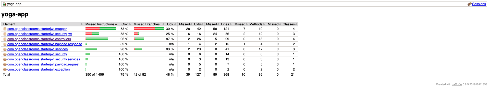
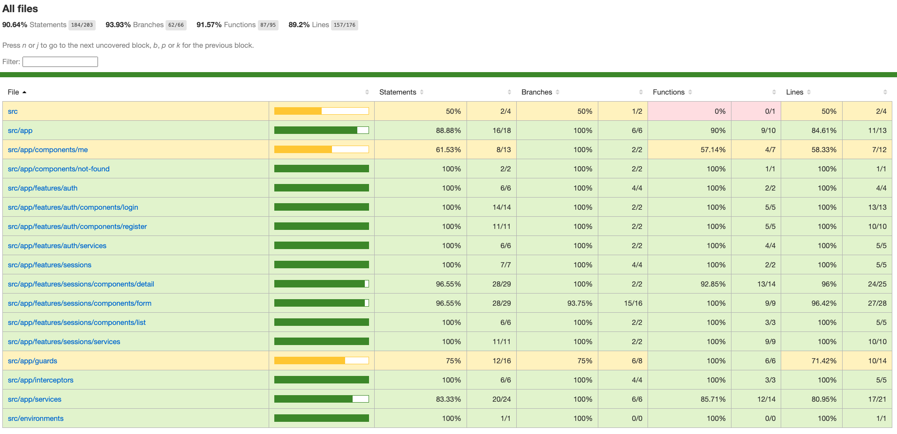

# YOGA-APP

Yoga app is an application that allows users to sign up for yoga and relaxation sessions. 
Users must create an account to access the list of available sessions. 
By clicking on a session, they access detailed information about it. They can sign up or unsubscribe.

For administrators, they can create, modify or delete sessions

## USING Yoga-app
To use Yoga-app, follow these steps:

* Clone the repository

## DATABASE

### Prerequisites
* Mysql 8.x.x

### INSTALLATION

* After installing mysql, and setting your username and password, open a terminal and use the command :

  ```
  mysql -u username -p password
  ```

* Now create the database using this command :

  ```
  CREATE DATABASE test
  ```
  :warning: Here the database name is "test". If you decide to give it a different name, don't forget to update the application.properties
  file in the backend with your database name.


* Select the database you just created using the following command : 

  ```
  USE test
  ```
  :warning: Remember to use the correct database name if you gave it a different name.


* Finally, the last step is to create the database tables. A script for this is available at the base of the project, in the "resources" folder 
and the "sql" subfolder. Copy the file path and run the command::

  ```
  SOURCE /path/to/script.sql
  ```
* This will create the tables and insert a user with the administrator role that you can use to log into the application.
  * email : yoga@studio.com
  * password : test!1234


## <ins>BACK-END</ins>

### Prerequisites

* Java 11
* IDE like Intellij / Eclipse


### Project setup :


* Open your IDE, choose "File", "Open" and select the "back" folder of the project.


* Open the application.properties file and edit the following lines:
  ```
  spring.datasource.url=jdbc:mysql://localhost:3306/test?allowPublicKeyRetrieval=true
  spring.datasource.username=your_db_username 
  spring.datasource.password=your_db_password 
  ```
  :warning: change the mysql port if it is not 3306, the database name if the name is not "test" and add your credentials to connect to the database

### Run the project

* In your terminal, go to "back" folder and start the application using one of the following commands:
  
  ```
  mvn clean install
  java -jar target/yoga-app-0.0.1-SNAPSHOT.jar
  ```
  **or**
  ```
  mvn spring-boot:run
  ```
  
### TESTS

* To run tests performed with Junit, in the terminal, type the following command:

  ```
  mvn clean test
  ```
  This command generates a coverage report that you can retrieve from this location:

  :point_right: ./target/site/jacoco/index.html

  &nbsp;

  The coverage rate is currently 98%
  


* To run all tests, including integration tests, run the following command:
  ```
  mvn clean verify
  ```
  In addition to the unit test coverage report, this command generates a coverage report for integration tests that you can retrieve from this location:

  :point_right: ./target/site/jacoco-report-integration/index.html

  &nbsp;

  The integration test coverage rate is currently 75%
  

## <ins>FRONT-END</ins>

### Prerequisites

* Node 16.x.x
* Angular 14
* IDE VS code / Sublime text

### Run the project
* Open your IDE, choose "File", "Open Folder" and select the "front" folder of the project.
* install dependencies
    ```
    npm install
    ```
* start the development server
    ```
    npx ng serve
    ```
  :point_right: This command allows you to launch the application with the correct version of Angular defined in the package.json 
in case you have another version of Angular installed globally.
- Open your browser and navigate to:
    ```
    http://localhost:4200
    ```
  ### TESTS
* To run tests performed with Jest, in the terminal, type the following command:
  ```
  npm run test -- --coverage
  ```
  This command generates a coverage report that you can retrieve from this location:

  :point_right: ./coverage/jest/lcov-report/index.html
  
  &nbsp;
  
  The coverage rate is currently 95.9%
  


* To start e2e tests, stop the application because cypress uses the same port, then run the following command:
  ```
  npm run e2e
  ```
  * The cypress interface will open. Choose a browser (e.g. Google Chrome) and click on Strat E2E Testing in Chrome)
  * In the "Specifications" section, you will find all the tests performed per component. You can choose to run the tests for a specific component by clicking on the desired file (e.g., login.cy.ts)
  or run all the tests at once by clicking on all.cy.ts.
  

* To generate the coverage report type the command : 
  ```
  npm run e2e:coverage
  ```
  This command generates a coverage report that you can retrieve from this location:

  :point_right: ./coverage/lcov-report/index.html

  &nbsp;

  The coverage rate is currently 90.64%
  
